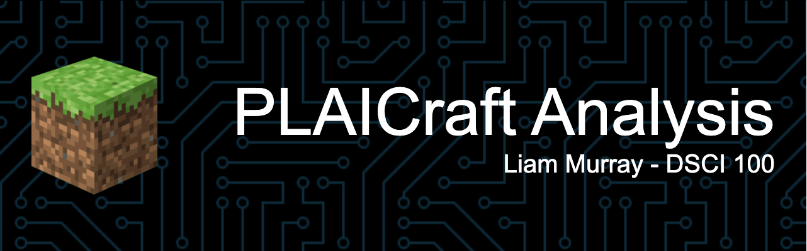

> This is a project by Liam Murray ([@liammurray123](https://github.com/liammurray123)), started on May 21st, 2025.

### Project Description ℹ️
This project contains an entire data science workflow to analyze the PLAICraft dataset, form a predictive question, and appropriately communicate an answer. This project was built using knowledge and skills developed within UBC's DSCI 100 course.

### What's inside 📦

- `Analysis.ipynb` this where the magic happens. It includes the entire Data Science workflow to answer questions on the PLAICraft data.
- `Explore Datasets.ipynb` this file includes some exploratory work on the PLAICraft data, it's peripheral to the main work.
- `Data` and `Visuals` are both resource folders, which include the `.csv` files and image resources.

### License 📝
This project is under the [MIT License](https://github.com/liammurray123/DSCI-100-Final-Project/blob/main/LICENSE). This can be accessed through the `LICENSE` file.